**Laboratorio 1/s1c1: Billing**

Crear una alarma cuando el consumo de recursos sobrepasa un valor mensual
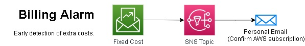

**Laboratorio 1/s1c2: IAM - Usuario Admin**

Crear un usuario para cumplir mejor practica, no usar Root Account
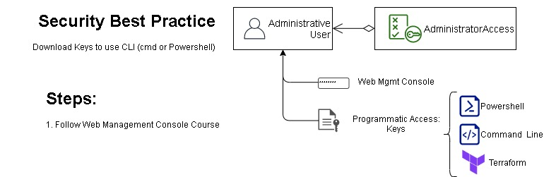

**Laboratorio 2/s2c1: IAM - Diagrama General**

Crear un grupo y agregarle un usuario. Luego,  agregar politicas manejadas por el usuario al grupo.
Crear un role y asignarle politicas manejadas por AWS. Modificar su entidad de confianza.
Permitir que el usuario pueda asumir un role, y verificar la ejecucion de ambas politicas.

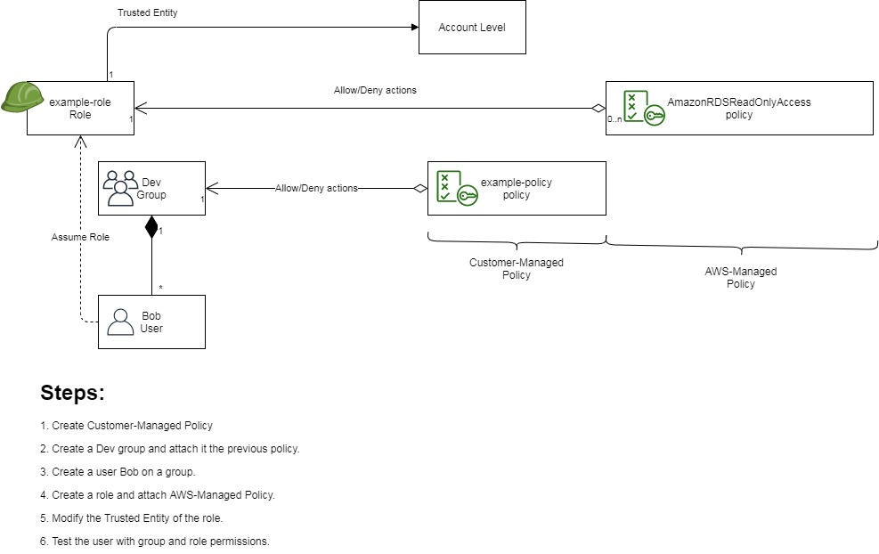

**Laboratorio 3A/s3c1: S3 Web Hosting - Diagrama General**

Crear un bucket, asignarles permisos de recurso al bucket creado.
Sincronizar repositorio local con el bucket.
Finalmente, habilitar caracteristicas de hosting estatico.

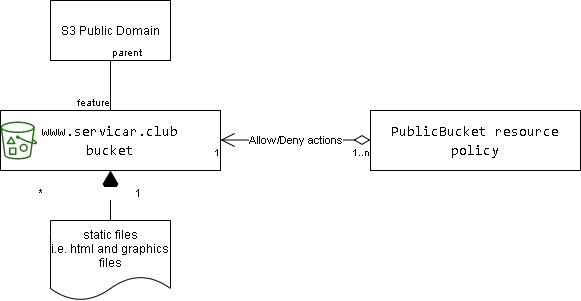

**Laboratorio 3B/s3c1: S3 Cross-Region Replication and Versioning - Diagrama General**

Crear 2 Buckets origen y destino. Habilitar versionamiento.
Crear role y aplicar condiciones para los buckets creados.
Configurar la caracteristicas de replicacion con el rol anterior

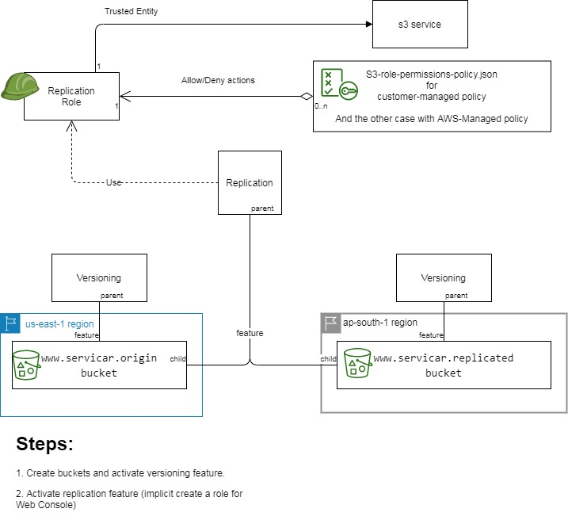

**Laboratorio 4A/s4c1: VPC, IGW, NAT GW, Sec. Group y NACL - Diagrama General**

Crear 1 VPCs, 2 Subredes Privada y Publica en diferente AZ. 
Crear instancias en cada subred (sencillas se verá el Lab5c1).
Definir cada una subred publica y la otra privada, y asignar Internet Gateway y NAT Gateway respectivamente.
Ejecutar acciones sobre Security Groups y NACLs para probar seguridad entre instancias.

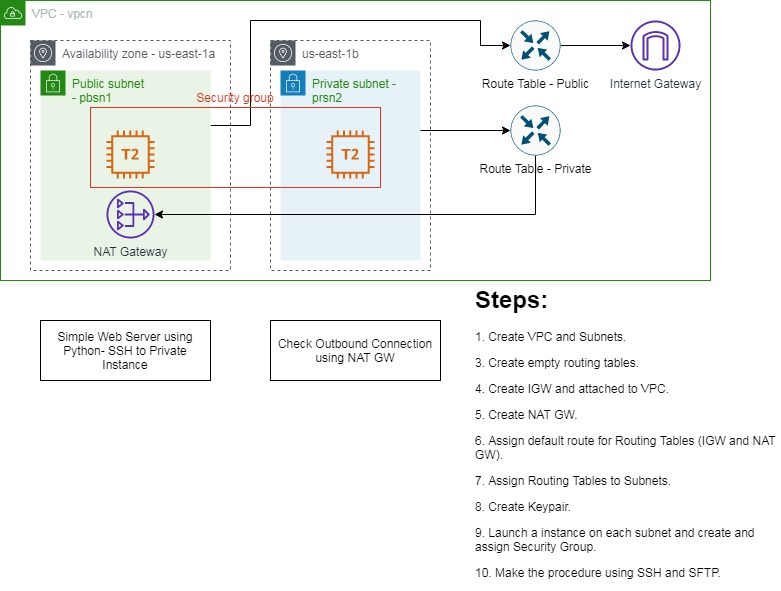

**Laboratorio 4B/s4c2: VPC Peering y VPC Endpoint - Diagrama General**

Crear 2 VPCs: Publica y Privada, crear subred en una.
Crear una VPC Peering para visualizar las 2 VPCs.
Crear subred privada en VPC Privada.
Crear un VPC Endpoint para visualizar un bucket S3 en VPC Privada.

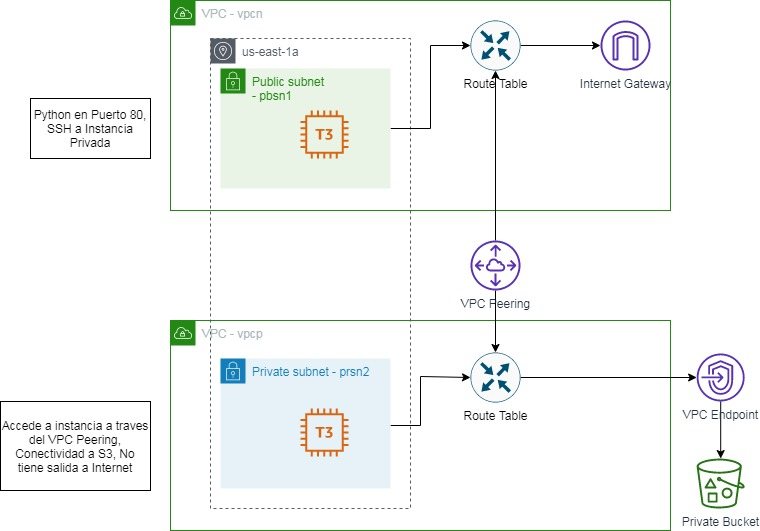

**Laboratorio 5A/s5c1: EC2**

Montar una instancia spot sencillo en una red publica.
Crear un bootstrap o User Data Script al iniciar la instancia, para instalar Docker.
Crear una ENI adicional a una instancia publica y asignarle una EIP. Acceder a la EIP.
Ejecutar docker.

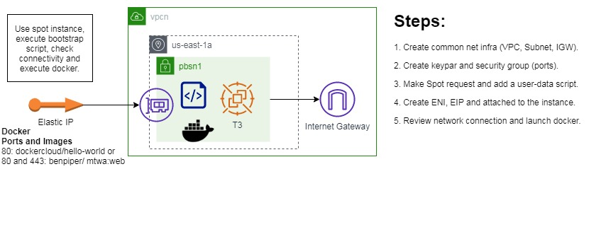

**Laboratorio 5B/s5c2: EC2 - Application Elastic Balancer**

Crear una Balanceador de carga tipo Aplicacion y aplicarla en un VPC publica con 2 subredes y 2 instancias.
Ejecutar multiples contenedores para probar enrutamiento por Path.

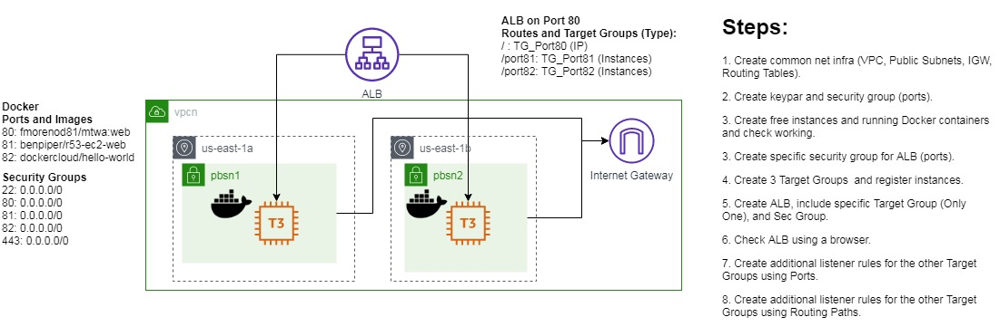

**Laboratorio 6A/s6c1: EC2 - Network Elastic Balancer**

Crear una Balanceador de carga tipo Aplicacion externa y aplicarla en un VPC publica con 2 subredes y 2 instancias
Crear una Balanceador de carga tipo Red interna y aplicarla en un VPC privada con 2 subredes y 2 instancias
Montar una VPC Peering para comprobar funcionamiento de la NLB.
Probar con el health check de los balanceadores.

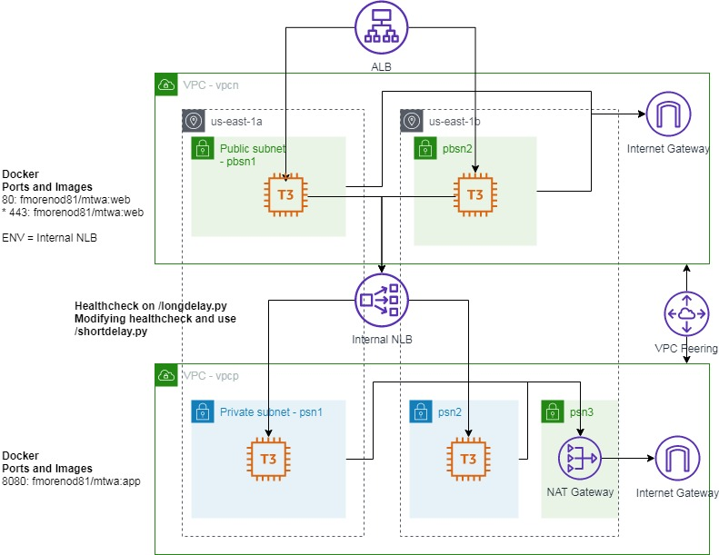

**Laboratorio 6B/s6c2 - EC2 - Autoscaling**

Ejecutar una sistema de Autoescalamiento de la VPC Publica, estressar la CPU para comprobar alarmas de Cloudwatch y Autoscaling Group

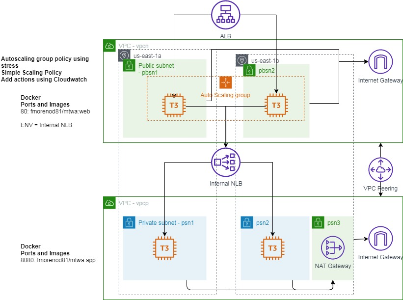

**Laboratorio 7A/s7c1 - MySQL RDS using Read Replica**

Realizar una conexion a MySQL, realizar una read Replica y comprobar funcionamiento. Invertir endpoints y comprobar lectura/escritura.

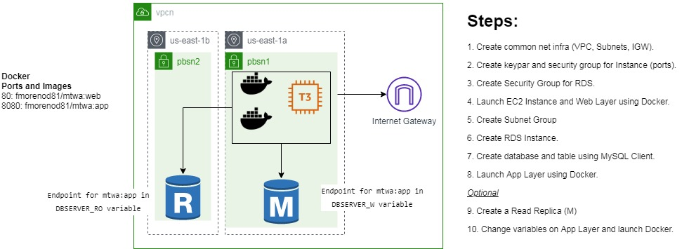

**Laboratorio 8A/s8c1 - DynamoDB Streams and Lambda**

Crear una tabla DynamoDB con Streams habilitado, y crear un flujo usando Lambda para notificaciones por Email. Se usa SNS para  las notificaciones.

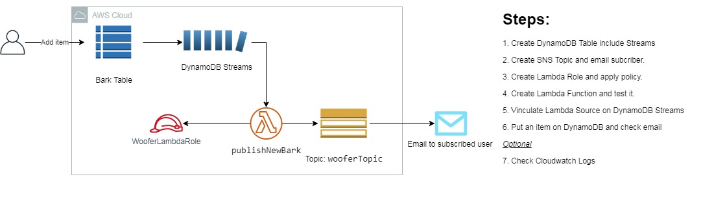

**Laboratorio 9A/s9c1 - EBS and Multi-Attach EBS**

Crear 2 instancias con EBS sencillo, y luego crear un Multi-Attach EBS agregando a las instancias

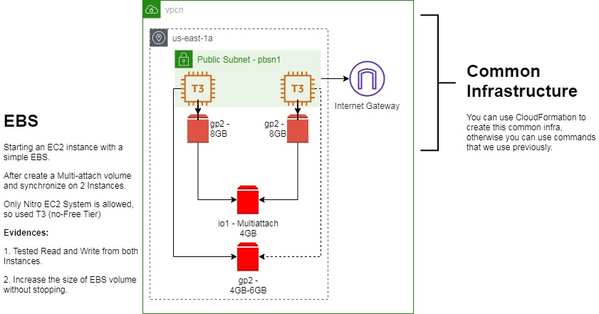

**Laboratorio 10A/s10c1 - Route 53 - Geolocalization Policy**

Enrutar usando politicas de geolocalizacion de IPs a diferentes instancias publicas.

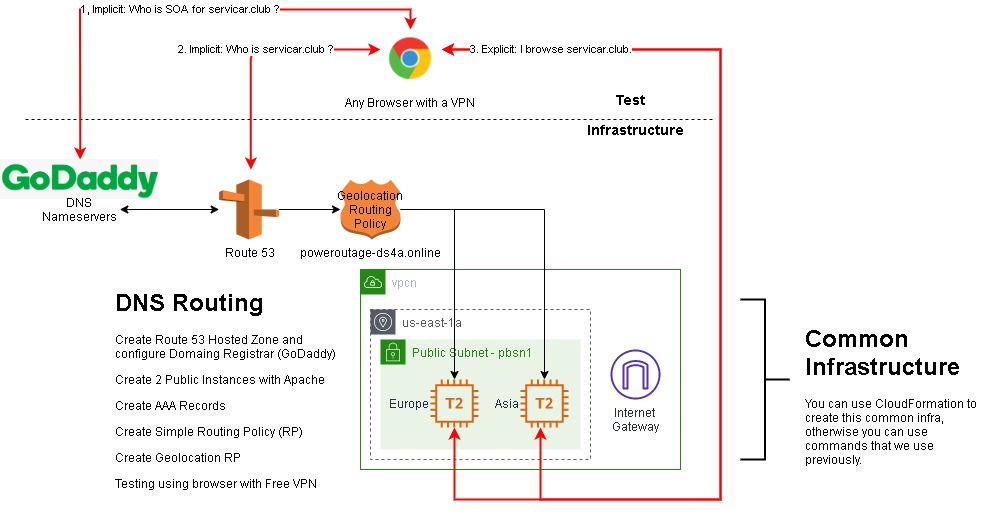

**Laboratorio 10A/s10c1 - ACM Public Certificate **

Crear certificado publico y asociarlo a un ALB.

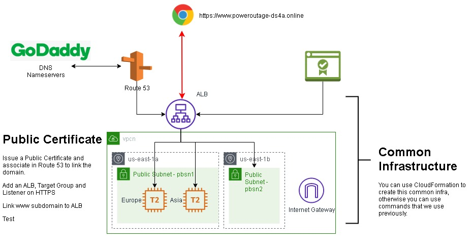
